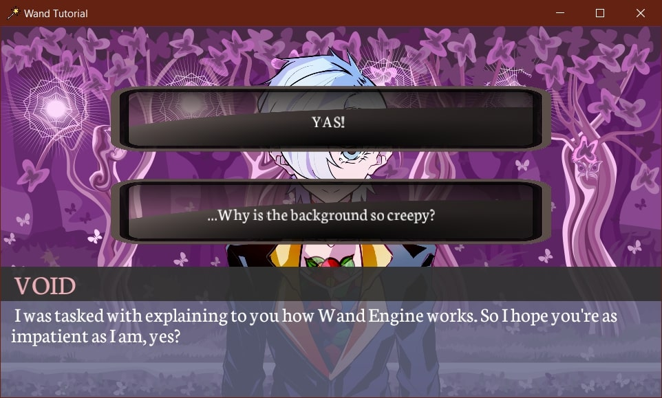

# Wand Tutorial

This simple visual novel is an example game made with [Wand Engine](https://github.com/mariaviolaki/wand). The game's main character, Void, explains the main features of the engine, including choice buttons, game states, audio, and positioning sprites on the screen.

The game runs on Windows x64 platforms and is developed in C++ with Visual Studio.

## Project Dependencies

* Windows SDK Version >= 10.0
* Platform Toolset >= Visual Studio 2022
* C++ Language Standard >= ISO C++20 Standard
* C Language Standard >= ISO C17 (2018) Standard

## Project Details

The Visual Studio solution contains 2 different projects, each of them in its own separate folder:
* Wand: Project including all the engine code.
* Game: Project intended for the game developer. Includes code, assets, and game states.

The game has features such as the following:
* Handling user input (mouse and keyboard)
* Positioning game entities relative to their layouts
* Rotating and flipping game entities
* Playing music and sound effects
* Saving states, consisting of name-value pairs, into a file
* Grouping together different sprites for the same character
* Loading assets, such as audio and fonts
* Other utility functions, such as easily converting a string to uppercase